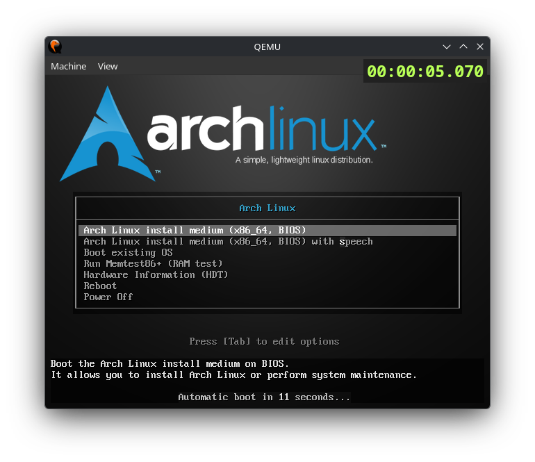

## qemu-sr

A QEMU fork with an embedded overlay for speedrun timing.

---

### Usage
Copy `style.css` from project root to `$XDG_CONFIG_HOME/qemu-sr/style.css`.

Use `qemu-system-X` as regular one.

### Building
1. `git clone https://github.com/kotleni/qemu-sr`
2. `cd qemu-sr`
3. `mkdir build && cd build`
4. `../configure`
5. `make -jX`

